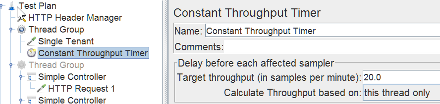

### Constant Throughput Timer

Target throughput(in samples per minute): X. This means send one request every 60/X second(s)

> __This will send one request every 3 seconds__
>
> __Thread Group__
> > * Number of Threads(users): 1
> > * Ramp-Up Period(in seconds): 1
> > * Loop Count: 20
>
> __Constant Throughput Timer__
> > * Target throughput(in samples per minute): 20

> __This will send two requests every 3 seconds__
>
> __Thread Group__
> > * Number of Threads(users): 2
> > * Ramp-Up Period(in seconds): 1
> > * Loop Count: 20
>
> __Constant Throughput Timer__
> > * Target throughput(in samples per minute): 20

